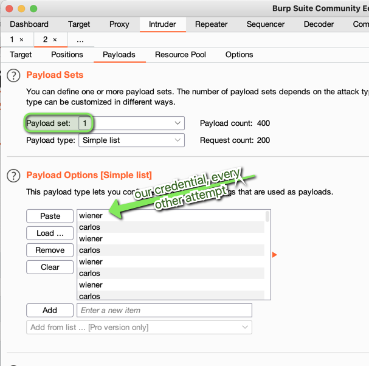
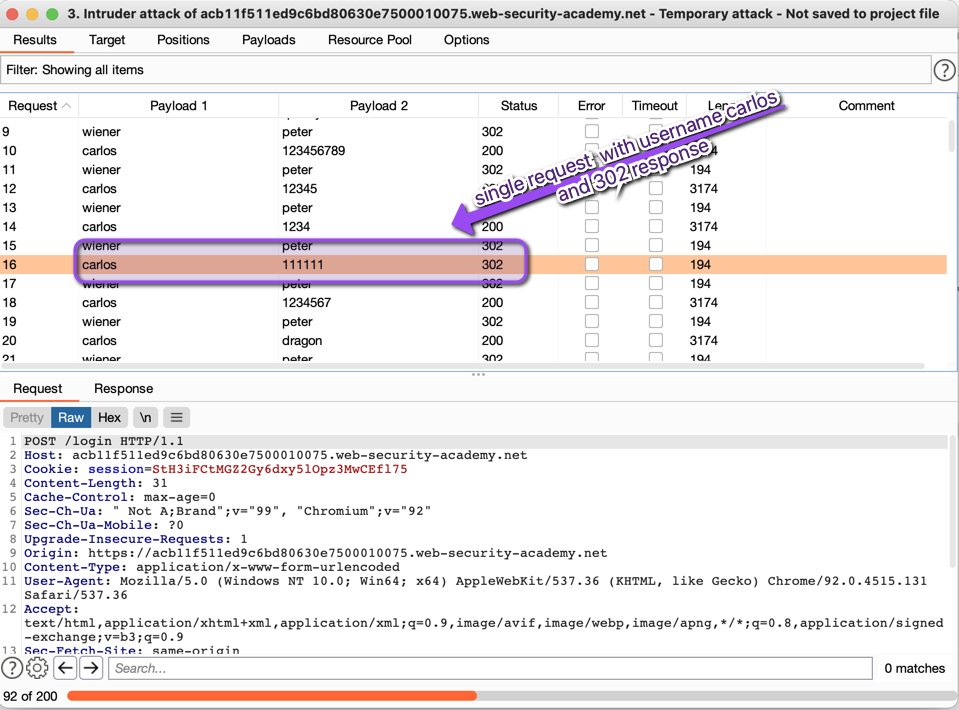
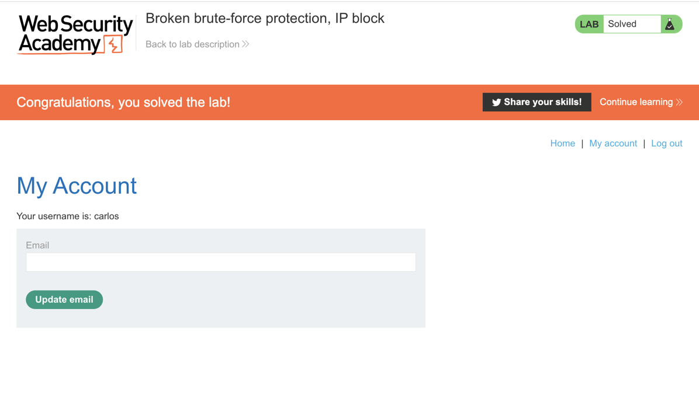

# Brute-force prevention logic, IP blocking

## Authentication

### password based login

> Jacob  Scheetz | August 2021

- basic bruteforce protection logic can be subverted by logging into a valid account every few attempts so that a bunch of invalid attempts aren't strung together
  - this can be done by  creating an account or knowing valid credentials already

- the intruder pitchfork attack will be used on the username and password field after capturing an invalid login attempt
  - to ensure the IP doesn't get blocked, the username and password combo of wiener:peter, will be lined up between payload 1 and 2- as seen below:
    - 
    - 1[pay2](Assets/img/payload2.png)

- a single request with the username carlos should have a 302 (user found) response
  - to make this easier to find you can sort by response and then by username
  - 
  - 
  