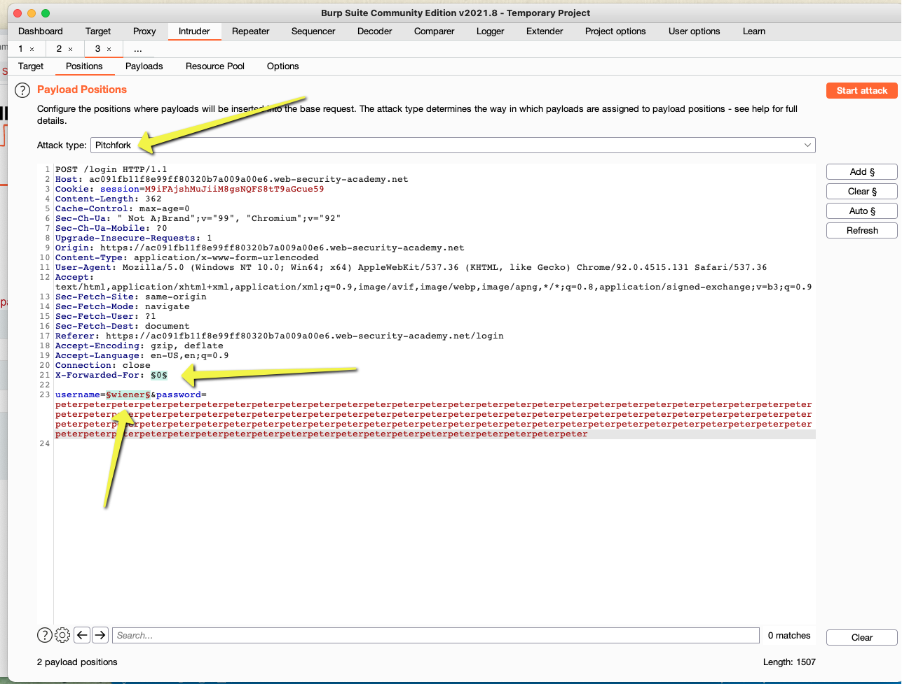
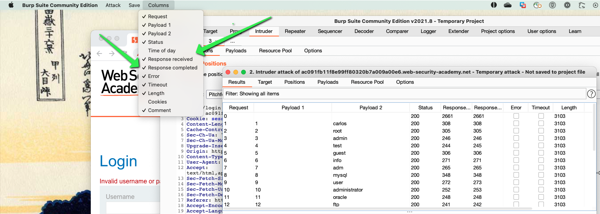
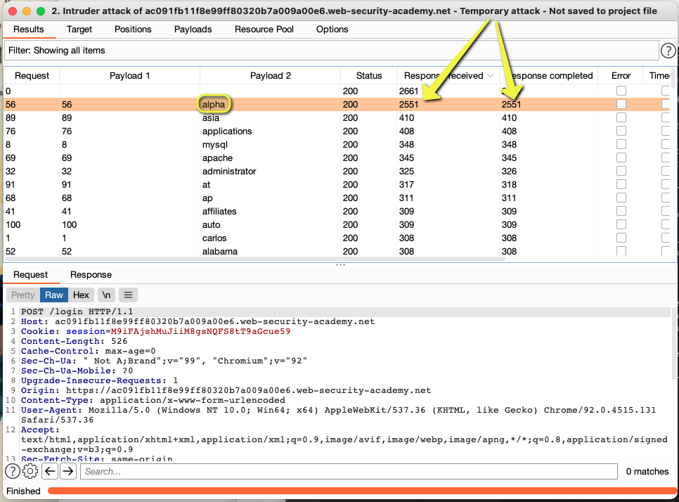
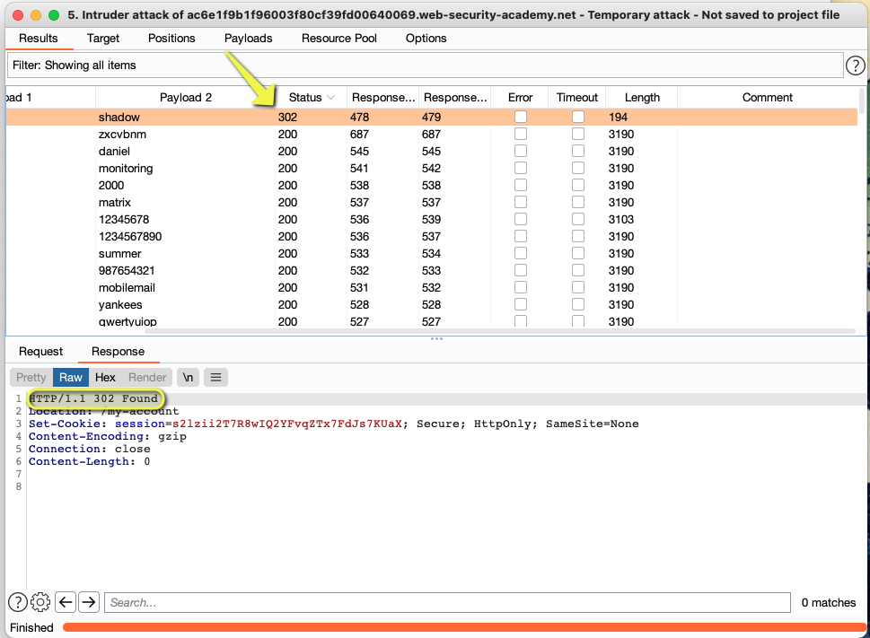

# Password timing attacks

## Authentication

### password based login

> Jacob Scheetz | August 2021

- X-Forwarded-For header can be used to bypass IP blocking if it is enabled
  - give it a random int and it needs to be increased each time to bypass the IP blocking done on the server side
  - i.e. X-Forwarded-For: 500, in one request would neeed to be X-Forwarded-For: 501
  - to automate this on a POST request, we would just set the value of the X-Forwarded-For header as an option in intruder and make it a number that steps by 1

- use a pitchfork attack in intruder so that the X-Forwarded-For header and a username list can both be used as payloads at the same time

- 

- enable the response received and the response completed column options in burp
  - sort by these columns once the attack has completed and then the longest one would indicate the valld username found

  - 

- After running the attack, look for the one's with the longest response times

  - 

- this process can be repreated for the password, you just have to switch the password field as the payload in burp

  - 
